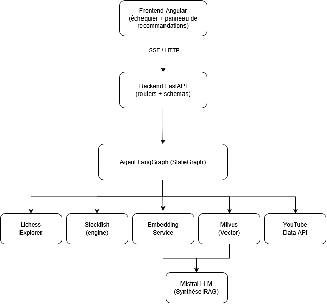

# Assistant d'échecs IA


Cette application aide un joueur à progresser sur les ouvertures d'échecs.
Elle affiche un échiquier interactif et, à chaque coup joué, un agent
analyse la position en s'appuyant sur plusieurs sources : la théorie
d'ouverture connue (Lichess Opening Explorer), une évaluation moteur
(Stockfish), une base de connaissances sur les ouvertures interrogée par
recherche vectorielle (RAG sur des articles Wikichess) et des vidéos
pédagogiques (YouTube). Le tout est orchestré par un agent LangGraph et
restitué sous forme d'explication en langage naturel par le LLM Mistral.

## Sommaire

- [Architecture](#architecture)
- [Prérequis](#prérequis)
- [Démarrage rapide (Docker)](#démarrage-rapide-docker)
- [Configuration](#configuration)
- [Développement local sans Docker](#développement-local-sans-docker)
- [Indexation et évaluation du RAG](#indexation-et-évaluation-du-rag)
- [API](#api)
- [Documentation complémentaire](#documentation-complémentaire)

## Architecture



Le graphe d'agent (`backend/app/services/rag_graph.py`) reçoit le FEN de la
position jouée et déroule les étapes suivantes :

1. Le nœud `lookup_opening` interroge le Lichess Opening Explorer pour savoir
   si la position appartient à la théorie connue et récupère les coups joués
   par les maîtres.
2. En parallèle, le nœud `evaluate_position` lance Stockfish pour évaluer la
   position et proposer un coup.
3. Si une ouverture nommée est identifiée, l'agent poursuit sa recherche :
   `embed_query` vectorise le nom de l'ouverture avec un modèle
   `sentence-transformers` (Qwen3-Embedding), `search_milvus` recherche par
   similarité cosinus dans Milvus (filtrée sur l'ouverture identifiée) parmi
   les chunks Wikichess indexés, `search_videos` recherche des vidéos
   YouTube pertinentes, puis `format_results` trie et met en forme les
   résultats.
4. Le frontend reçoit la progression de l'agent via un flux SSE
   (`/api/v1/agent/stream`), puis demande la synthèse textuelle en streaming
   au LLM Mistral (`/api/v1/agent/answer/stream`), qui rédige une explication
   concise à partir des extraits Wikichess retrouvés.

Chaque étape peut échouer indépendamment (API externe indisponible, quota
dépassé, etc.) sans bloquer les autres : l'agent continue avec les sources
disponibles et affiche l'erreur propre à chaque étape dans la timeline
« Étapes de l'agent » du frontend.

## Prérequis

- Docker et Docker Compose
- Une clé API [Mistral](https://console.mistral.ai/api-keys) (gratuite) pour
  la synthèse RAG
- Une clé [YouTube Data API v3](https://console.cloud.google.com/apis/library/youtube.googleapis.com)
  pour les recommandations vidéo
- (Optionnel) Un [jeton personnel Lichess](https://lichess.org/account/oauth/token)
  pour éviter les limites de requêtes anonymes sur l'Opening Explorer

## Démarrage rapide (Docker)

```bash
cp .env.example .env   # puis renseigner les clés API
docker compose up -d
```

- Frontend : http://localhost:4200
- Backend : http://localhost:8000 (docs interactives sur `/docs`)
- Milvus : `localhost:19530` (administration via Attu si besoin)

Au premier démarrage, la base vectorielle Milvus est vide : lancez le script
d'indexation (voir plus bas) avant de jouer un coup, sinon l'agent
fonctionnera mais sans le RAG Wikichess.

## Configuration

Toutes les variables sont définies dans `.env` (voir `backend/app/config.py`
pour les valeurs par défaut) :

| Variable                             | Rôle                                                    |
| ------------------------------------ | ------------------------------------------------------- |
| `MISTRAL_API_KEY`                    | Génération de la réponse RAG en langage naturel         |
| `YOUTUBE_API_KEY`                    | Recherche de vidéos pédagogiques par ouverture          |
| `LICHESS_TOKEN`                      | Jeton optionnel pour l'Opening Explorer                 |
| `STOCKFISH_PATH` / `STOCKFISH_DEPTH` | Binaire et profondeur d'analyse                         |
| `MILVUS_HOST` / `MILVUS_PORT`        | Connexion à la base vectorielle                         |
| `EMBEDDING_MODEL`                    | Modèle `sentence-transformers` utilisé pour l'embedding |
| `RAG_TOP_K`                          | Nombre de chunks Wikichess remontés par recherche       |

## Développement local sans Docker

```bash
# Backend
cd backend
python -m venv .venv && .venv/Scripts/activate  # ou source .venv/bin/activate
pip install -r requirements.txt
uvicorn app.main:app --reload

# Frontend
cd frontend
npm install
npm start   # lance tailwind:watch + ng serve en parallèle
```

Milvus (et ses dépendances etcd/minio) doivent tourner quelque part
(localement via `docker compose up -d etcd minio milvus`, ou un cluster
distant) ; ajustez `MILVUS_HOST`/`MILVUS_PORT` en conséquence.

## Indexation et évaluation du RAG

```bash
cd backend

# Indexer (ou ré-indexer) les articles Wikichess dans Milvus
python scripts/ingest_wikichess.py --reset

# Évaluer la qualité de la recherche vectorielle (Hit@K, Recall@K, NDCG@K, MRR)
python scripts/evaluate_rag.py --k-values 1,3,5 --json rapport_rag.json
```

Le jeu d'évaluation (`scripts/rag_eval_dataset.json`) associe des requêtes
(noms d'ouvertures et de variantes) à l'article Wikichess attendu. Voir
[docs/rag_recall_improvements.md](docs/rag_recall_improvements.md) pour le
détail des optimisations appliquées à la recherche vectorielle et leur impact
mesuré sur ce jeu d'évaluation.

## API

Principaux endpoints exposés sous `/api/v1` (documentation interactive
complète sur `/docs`) :

| Endpoint                    | Description                                                                      |
| --------------------------- | -------------------------------------------------------------------------------- |
| `GET /agent/stream?fen=...` | Flux SSE de l'analyse complète d'une position (théorie, évaluation, RAG, vidéos) |
| `GET /agent/{fen}`          | Équivalent non streamé de l'analyse complète                                     |
| `POST /agent/answer/stream` | Synthèse LLM en streaming à partir de résultats RAG déjà récupérés               |
| `GET /moves/{fen}`          | Théorie d'ouverture (Lichess Explorer) pour une position                         |
| `GET /evaluate/{fen}`       | Évaluation Stockfish d'une position                                              |
| `GET /vector-search`        | Recherche vectorielle brute (sans filtre d'ouverture) dans Wikichess             |
| `GET /videos/{opening}`     | Recherche de vidéos YouTube pour une ouverture                                   |

## Documentation complémentaire

- [docs/rag_recall_improvements.md](docs/rag_recall_improvements.md) détaille
  les optimisations apportées à la recherche vectorielle ainsi que les
  mesures avant/après.
- [docs/etude_faisabilite_analyse_video.md](docs/etude_faisabilite_analyse_video.md)
  est une étude de faisabilité sur l'architecture, les bénéfices, les limites
  et les coûts d'une extension du RAG à l'analyse du contenu des vidéos,
  au-delà des seules métadonnées YouTube utilisées aujourd'hui.
